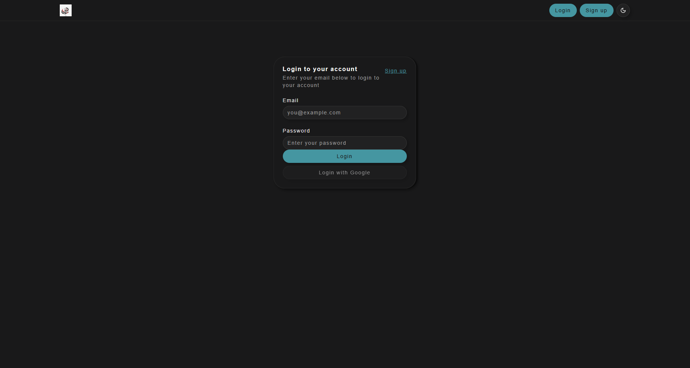
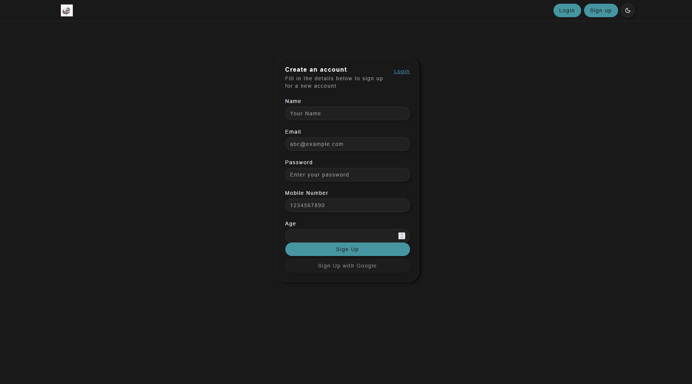

# 🔐 Authentication with React, ShadCN, and Appwrite

This project is a modern authentication system built using **React**, **ShadCN UI**, and **Appwrite**. It supports **sign up**, **login**, **logout**, **session-based user context**, and **Google OAuth**, all styled with ShadCN UI and deployed via **Vercel**.

## 🚀 Live Preview 👉 [View Live](https://authentication-using-shadcn-in-reac.vercel.app/)

## 📁 Features

- 🔑 **Sign up and login with email/password**
- 🧠 **Context-based user session management**
- 🔄 **Persistent login after refresh**
- ⚙️ **Logout functionality**
- 🌐 **Google OAuth (optional)**
- 🧭 **Routing with React Router**
- ✨ **Responsive UI with ShadCN**
- ☁️ **Deployed to Vercel**

## 🚀 How to Run

### 1. Clone the repo:

```bash
git clone https://github.com/your-username/authentication-react-appwrite
cd authentication-react-appwrite
```

### 2. Install dependencies:

```bash
npm install
```

### 3. Set up `.env`:

```bash
VITE_APPWRITE_ENDPOINT=https://fra.cloud.appwrite.io/v1
VITE_APPWRITE_PROJECT=your-project-id
VITE_APPWRITE_COLLECTION=your-collection-id
```

### 4. Run locally:

```bash
npm run dev
```

## 🧠 What I Learned

- ✅ How to integrate **Appwrite** for full-stack auth
- 🔄 Implementing **context providers** to manage session across app
- 🚪 How to protect routes using **React Router** and redirect unauthenticated users
- 🎨 Used **ShadCN UI** for building accessible and clean UI components
- 🌐 Setting up **CORS** and **platforms** in Appwrite for production
- 📦 Deploying a **React SPA to Vercel** and fixing issues like 404 on refresh
- ⚙️ Creating a `vercel.json` to rewrite paths for SPA routing
- 📄 Using `.env` for safe and flexible config

## 🌍 Deployment Notes

- Ensure your Vercel **project domain** is added to Appwrite → Project → Settings → Platforms → Add Web Platform
- In Appwrite settings → **CORS**, add allowed origins like:

  - `https://authentication-using-shadcn-in-reac.vercel.app`

- Create a `vercel.json` file in the root:

```json
{
  "rewrites": [{ "source": "/(.*)", "destination": "/" }]
}
```

- Commit and redeploy after each change

## 📎 Tech Stack

- React
- ShadCN UI
- Appwrite
- Vite
- Tailwind CSS
- Vercel

# Screenshot




## 📫 Feedback

If you found this helpful or have suggestions, feel free to open issues or reach out!

> Made with ❤️ by Raj Singhaniya
